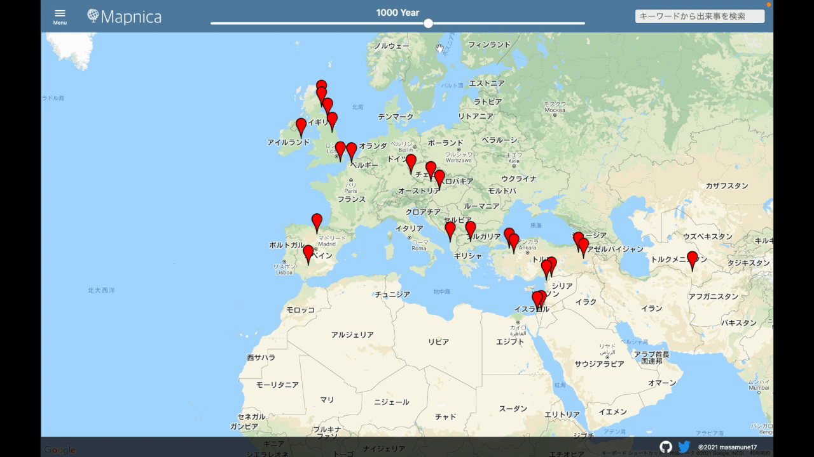

## Mapnicaとは
Mapnicaは歴史の出来事を地図上に表示するサービスです。<br>
年代やキーワードでの検索が可能で、検索した出来事が地図上に表示されます。

## ローカルでの立ち上げ方

```
$ git clone https://github.com/masamune17/mapnica.git
```

```
$ cd mapnica
```

```
$ bin/setup
```

```
$ rails s
```

上記を実行後[localhost](http://localhost:3000/)にアクセス

## test

```
$ bin/test
```

## Lint
```
$ bin/lint
```

## 使い方
### 歴史上の出来事を地図上にマーカーとして表示
* 歴史上の出来事を地図上にマーカーとして表示します。
* 表示されたマーカーをクリックすると、クリックされたマーカーの解説が表示されます。

### 年代による検索
* スライダーを操作することで年代による検索を実行し、検索結果のマーカーが地図上に表示されます。

### キーワード検索
* 入力したキーワードに合致した検索結果をリスト形式で表示します。
* 表示された検索結果をクリックすると、クリックされた検索結果の解説とマーカー、同じ年代の出来事が地図上に表示されます。

